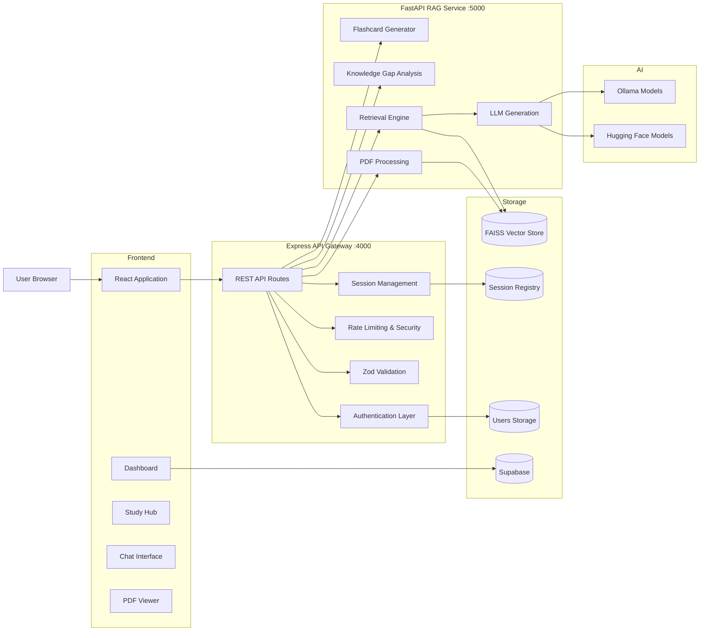
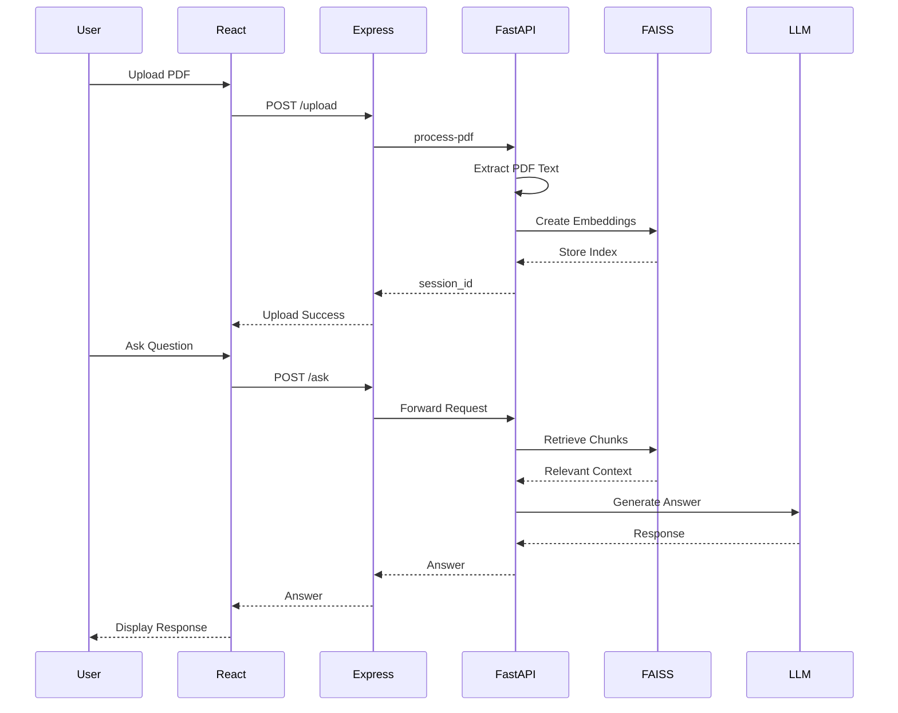

# ARCHITECTURE.md

# PDF Q&A Bot - System Architecture

## High-Level Overview

PDF Q&A Bot is a multi-service Retrieval-Augmented Generation (RAG) platform that enables users to upload PDF documents, ask contextual questions, generate summaries, create flashcards, and identify knowledge gaps from uploaded content.

The system follows a **layered microservice architecture** consisting of:

* A React frontend responsible for user interaction and visualization.
* A Node.js/Express API Gateway responsible for authentication, security, validation, session management, and orchestration.
* A FastAPI-based RAG service responsible for document ingestion, vector search, retrieval, reasoning, and AI-powered response generation.

The architecture prioritizes:

* Separation of concerns
* Security-first API design
* Independent scalability of AI workloads
* Session-isolated document processing
* Fault-tolerant PDF ingestion

---

# System Architecture



---

# Architectural Style

## Primary Style

**Microservice Architecture**

The system separates responsibilities into independently deployable services:

| Service             | Responsibility                       |
| ------------------- | ------------------------------------ |
| React Frontend      | User experience and visualization    |
| Express Gateway     | Security, orchestration, validation  |
| FastAPI RAG Service | AI processing and document retrieval |

This separation prevents AI workloads from impacting API responsiveness and enables independent scaling.

---

## Supporting Architectural Patterns

### API Gateway Pattern

Express acts as the single public entry point.

Responsibilities:

* Request validation
* Authentication
* Rate limiting
* Abuse prevention
* Service orchestration

### Retrieval-Augmented Generation (RAG)

The AI pipeline combines:

1. Document retrieval
2. Context construction
3. LLM generation

This reduces hallucination and grounds responses in uploaded content.

### Session-Isolated Processing

Each session owns:

* Documents
* Vector indexes
* Chat history
* Flashcards
* Knowledge gap results

This prevents cross-user data leakage.

---

# Tech Stack & Core Technologies

## Frontend

| Technology      | Purpose                  |
| --------------- | ------------------------ |
| React           | Main frontend framework  |
| React Router    | Client-side routing      |
| React PDF       | In-browser PDF rendering |
| React Bootstrap | UI components            |
| React Hot Toast | Notifications            |
| Axios           | API communication        |

---

## Backend Gateway

| Technology         | Purpose                |
| ------------------ | ---------------------- |
| Node.js            | Runtime environment    |
| Express            | API framework          |
| JWT                | Authentication         |
| bcryptjs           | Password hashing       |
| Helmet             | Security headers       |
| express-rate-limit | Abuse prevention       |
| express-slow-down  | Progressive throttling |
| Zod                | Request validation     |
| Multer             | File uploads           |

---

## AI / RAG Layer

| Technology   | Purpose                       |
| ------------ | ----------------------------- |
| FastAPI      | AI service framework          |
| LangChain    | Retrieval pipeline            |
| FAISS        | Vector similarity search      |
| Hugging Face | Embeddings and generation     |
| Ollama       | Optional local LLM inference  |
| BM25         | Keyword retrieval enhancement |
| PyMuPDF      | Primary PDF extraction        |
| PyPDF        | Secondary PDF extraction      |
| OCR Pipeline | Scanned PDF support           |

---

## Data Storage

| Technology       | Purpose                              |
| ---------------- | ------------------------------------ |
| FAISS            | Vector storage                       |
| JSON Persistence | Session metadata                     |
| Supabase         | Dashboard and authentication support |
| Redis (optional) | Distributed rate limiting            |

---

## Infrastructure

| Technology     | Purpose             |
| -------------- | ------------------- |
| Docker         | Containerization    |
| Docker Compose | Local orchestration |
| GitHub Actions | CI workflows        |
| CodeQL         | Security scanning   |

---

# Directory Structure

```text
pdf-qa-bot/
│
├── frontend/
│   ├── components/
│   ├── contexts/
│   ├── pages/
│   ├── services/
│   └── utils/
│
├── rag-service/
│   ├── crawler/
│   ├── scripts/
│   ├── tests/
│   └── main.py
│
├── src/
│   ├── controllers/
│   ├── middleware/
│   ├── routes/
│   └── utils/
│
├── security/
│
├── validators/
│
├── supabase/
│
├── uploads/
│
└── server.js
```

---

# Key Components & Modules

## Frontend Layer

### Main Application

Responsible for:

* Upload workflow
* Chat interface
* Session restoration
* PDF management

Key capabilities:

* Multi-document sessions
* Saved notes
* Flashcards
* Knowledge gap analysis
* Streaming responses

---

## Authentication Layer

The codebase currently contains two authentication systems.

### JWT Authentication

Used by Express APIs.

Flow:

```text
Signup/Login
    ↓
Password Validation
    ↓
bcrypt Hashing
    ↓
JWT Generation
```

---

### Supabase Authentication

Used by dashboard-related frontend features.

Responsibilities:

* Session management
* User state tracking
* Authentication persistence

---

## API Gateway

### Responsibilities

* Request validation
* Authentication
* Upload orchestration
* Session lookup
* Security enforcement

The gateway intentionally prevents direct public access to the AI service.

---

## Validation Layer

Implemented using Zod schemas.

Validates:

* Questions
* Session identifiers
* Session secrets
* Flashcard requests
* Knowledge gap requests

Benefits:

* Early rejection of invalid requests
* Consistent API contracts
* Reduced processing overhead

---

## Security Layer

### Protection Mechanisms

#### Rate Limiting

Prevents API abuse.

#### Progressive Slowdown

Introduces latency before hard blocking.

#### IP Ban System

Escalating penalties:

1. 5 minutes
2. 15 minutes
3. 1 hour

#### Internal Service Authentication

Protected AI endpoints require:

```http
X-Internal-Token
```

This prevents bypassing gateway protections.

---

## RAG Service

### PDF Processing Pipeline

Supports multiple extraction strategies:

```text
PyMuPDF
    ↓
PyPDF Fallback
    ↓
OCR Fallback
```

Benefits:

* Higher reliability
* Better support for academic PDFs
* Scanned document compatibility

---

## Retrieval Engine

Responsible for:

* Semantic search
* Context ranking
* Evidence extraction
* Retrieval caching

Storage:

```text
Documents
    ↓
Embeddings
    ↓
FAISS Index
```

---

## Generation Engine

Supports:

### Hugging Face

Default local inference pipeline.

### Ollama

Optional local LLM deployment.

Used for:

* Question answering
* Summarization
* Flashcard generation
* Knowledge gap analysis

---

# Data Flow / Request Lifecycle

## Upload and Question Answering Flow



---

# Session Lifecycle

```text
Upload PDF
    ↓
Create Session
    ↓
Generate Session Secret
    ↓
Build Vector Store
    ↓
Store Metadata
    ↓
Chat & Retrieval
    ↓
Flashcards / Knowledge Gaps
    ↓
Expiration & Cleanup
```

Sessions maintain:

* Documents
* Vector stores
* Chat history
* Flashcards
* Retrieval cache

---

# Design Patterns & Principles

## API Gateway Pattern

Express centralizes:

* Security
* Validation
* Routing
* Service communication

---

## Strategy Pattern

PDF ingestion dynamically selects:

```text
PyMuPDF
PyPDF
OCR
```

based on availability and extraction quality.

---

## Layered Architecture

```text
Presentation
    ↓
Gateway
    ↓
AI Service
    ↓
Storage
```

This separation improves maintainability and scalability.

---

## Failover Pattern

Document processing includes fallback mechanisms:

```text
Primary Loader
    ↓ fail
Secondary Loader
    ↓ fail
OCR Loader
```

Improves robustness.

---

## Defensive Programming

Observed throughout the codebase:

* Validation before execution
* Input normalization
* Explicit error handling
* Timeout protection
* Resource limits

---

# Infrastructure & Deployment

## Docker

The repository includes:

```text
Dockerfile
frontend/Dockerfile
docker-compose.yml
```

allowing full containerized deployment.

---

## Service Topology

```text
Frontend :3000
    ↓

Express Gateway :4000
    ↓

FastAPI RAG :5000
```

---

## Health Checks

FastAPI exposes:

```http
/health
/ready
```

for container orchestration readiness and liveness checks.

---

## CI/CD

GitHub Actions workflows include:

```text
.github/workflows/

ci.yml
codeql.yml
auto-label.yml
```

Capabilities:

* Continuous integration
* Static analysis
* Security scanning
* Automatic issue labeling

---

# Scalability Considerations

## Current Strengths

* Service separation
* Session isolation
* Redis-ready rate limiting
* Containerized deployment
* Independent AI scaling

---

## Potential Future Improvements

### Database-backed Session Storage

Current persistence relies primarily on JSON files.

Potential upgrade:

```text
PostgreSQL
MongoDB
Redis
```

---

### Distributed Vector Storage

Replace local FAISS with:

```text
Pinecone
Weaviate
Qdrant
Milvus
```

for multi-instance deployments.

---

### Background Processing

Move expensive PDF ingestion into:

```text
Celery
RQ
BullMQ
```

to improve responsiveness under load.

---

# Conclusion

PDF Q&A Bot is a security-conscious, session-isolated RAG platform built around a microservice architecture. The design cleanly separates user experience, API orchestration, and AI processing while providing robust document ingestion, retrieval, and generation capabilities. The architecture is structured for maintainability, local-first AI deployment, and future horizontal scalability.
