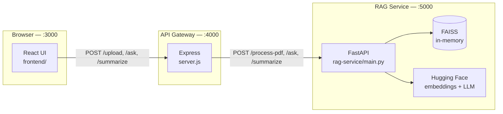

# PDF Q&A Bot

Upload PDF documents, ask natural-language questions grounded in their content, and generate concise summaries — all through a local, three-service stack. The React UI talks to a Node.js API gateway, which orchestrates a Python RAG (retrieval-augmented generation) service powered by Hugging Face embeddings and a configurable text-generation model.

---

## Table of Contents

- [Features](#features)
- [System Architecture](#system-architecture)
- [Prerequisites](#prerequisites)
- [Installation](#installation)
- [Running the Application](#running-the-application)
- [API Reference](#api-reference)
- [Configuration](#configuration)
- [Project Structure](#project-structure)
- [Troubleshooting](#troubleshooting)
- [Contributors](#-contributors)
- [Join the Community](#-join-the-community)
- [License](#license)

---

## Features

| Capability | Description |
|------------|-------------|
| **PDF upload** | Multipart upload with server-side parsing, chunking, and vector indexing |
| **Question answering** | Semantic search over document chunks, then local HF model generation |
| **Summarization** | Bullet-style summaries from retrieved context |
| **Multi-document UI** | Upload and switch between multiple PDFs (`frontend/`) |
| **In-browser viewer** | Page-by-page PDF preview with `react-pdf` |
| **Chat export** | Export conversation history as CSV or plain text |

---

## System Architecture

The application is split into three independently runnable components. Each listens on a dedicated port in development.



### Request lifecycle

1. **Upload** — The UI sends a PDF to Express (`POST /upload`). Express stores the file temporarily, forwards its path to FastAPI (`POST /process-pdf`), then deletes the local copy.
2. **Index** — FastAPI loads the PDF with LangChain, splits text into chunks, embeds them with `sentence-transformers/all-MiniLM-L6-v2`, and stores a FAISS index keyed by a new `session_id`.
3. **Ask / Summarize** — The UI includes `session_id` on each request. FastAPI retrieves relevant chunks, builds a prompt, and runs the configured Hugging Face generation model locally.

> **Note:** Vector stores live in process memory. Restarting the RAG service clears all sessions; users must re-upload PDFs.

### Default ports

| Service | Folder | Port | URL |
|---------|--------|------|-----|
| React frontend | `frontend/` | **3000** | http://localhost:3000 |
| Express API | repository root | **4000** | http://localhost:4000 |
| FastAPI RAG | `rag-service/` | **5000** | http://localhost:5000 |

---

## Prerequisites

| Tool | Version | Purpose |
|------|---------|---------|
| **Node.js** | LTS (18+) recommended | Express gateway and React dev server |
| **npm** | Bundled with Node.js | JavaScript dependencies |
| **Python** | 3.10 or newer | RAG service |
| **pip** | Current | Python dependencies |

Optional but recommended:

- **Git** — clone and contribute
- **CUDA-capable GPU** — faster Hugging Face inference (CPU works, slower)
- **8 GB+ RAM** — model loading and FAISS indexing

---

## Installation

Install dependencies in **all three** locations. Use three separate terminal sessions when running locally.

### 1. RAG service (`rag-service/`)

```bash
cd rag-service
python -m venv venv
```

**Windows (PowerShell)**

```powershell
.\venv\Scripts\Activate.ps1
python -m pip install --upgrade pip
pip install -r requirements.txt
```

**macOS / Linux**

```bash
source venv/bin/activate
python -m pip install --upgrade pip
pip install -r requirements.txt
```

Copy environment configuration from the repository root:

```bash
# From rag-service/, after activating the venv
cp ../.env.example .env    # macOS / Linux
copy ..\.env.example .env  # Windows (cmd)
Copy-Item ..\.env.example .env  # Windows (PowerShell)
```

Edit `.env` if you want a smaller or faster generation model (see [Configuration](#configuration)).

### 2. Express API (repository root)

```bash
cd ..          # repository root (parent of rag-service/)
npm install
```

Multer writes uploads to an `uploads/` directory at runtime; it is created automatically on first upload.

### 3. React frontend (`frontend/`)

```bash
cd frontend
npm install
```

The frontend `package.json` sets `"proxy": "http://localhost:4000"`, so development requests to `/upload`, `/ask`, and `/summarize` are forwarded to Express without CORS configuration in the browser.

---

## Running the Application

**Start services in this order** so the gateway and RAG layer are ready before you upload a file.

### Terminal 1 — RAG service

```bash
cd rag-service
# activate venv (see Installation)
uvicorn main:app --host 0.0.0.0 --port 5000 --reload
```

Alternative:

```bash
python main.py
```

### Terminal 2 — Express API

```bash
# repository root
node server.js
```

Expected log: `Backend running on http://localhost:4000`

### Terminal 3 — Frontend

```bash
cd frontend
npm start
```

Open **http://localhost:3000** in your browser.

### First-run model download

On the first PDF upload or first question, Hugging Face will download:

| Asset | Model ID | Approx. size |
|-------|----------|--------------|
| Embeddings | `sentence-transformers/all-MiniLM-L6-v2` | ~90 MB |
| Generation (default) | `google/flan-t5-base` | ~900 MB |

Downloads are cached under your user Hugging Face cache (e.g. `~/.cache/huggingface` on Linux/macOS, `%USERPROFILE%\.cache\huggingface` on Windows). The first request may take several minutes on a slow connection — this is normal.

---

## API Reference

### Express API (`http://localhost:4000`)

Public-facing routes used by the React app. All paths are relative to the gateway origin.

| Method | Endpoint | Content-Type | Request body / form | Success response | Error responses |
|--------|----------|--------------|----------------------|------------------|-----------------|
| `POST` | `/upload` | `multipart/form-data` | Field name **`file`** (PDF binary) | `200` — `{ "message": string, "session_id": string }` | `400` — no file; `500` — RAG processing failed |
| `POST` | `/ask` | `application/json` | `{ "question": string, "session_id": string }` | `200` — `{ "answer": string }` | `500` — upstream or internal error |
| `POST` | `/summarize` | `application/json` | `{ "session_id": string, "pdf"?: string }` | `200` — `{ "summary": string }` | `500` — upstream or internal error |

**Example — upload (curl)**

```bash
curl -X POST http://localhost:4000/upload \
  -F "file=@/path/to/document.pdf"
```

**Example — ask**

```bash
curl -X POST http://localhost:4000/ask \
  -H "Content-Type: application/json" \
  -d '{"question":"What is the main topic?","session_id":"<uuid-from-upload>"}'
```

---

### FastAPI RAG service (`http://localhost:5000`)

Internal service called by Express. You can call it directly for debugging.

| Method | Endpoint | Request body (JSON) | Success response | Notes |
|--------|----------|---------------------|------------------|-------|
| `POST` | `/process-pdf` | `{ "filePath": string }` | `{ "message": string, "session_id": string }` | Absolute or relative path to PDF on the machine running FastAPI |
| `POST` | `/ask` | `{ "question": string, "session_id": string }` | `{ "answer": string }` | Returns a friendly message if `session_id` is unknown |
| `POST` | `/summarize` | `{ "session_id": string, "pdf"?: string \| null }` | `{ "summary": string }` | `pdf` is accepted for API compatibility; indexing uses `session_id` only |

Interactive OpenAPI docs: **http://localhost:5000/docs**

**Example — process PDF (direct)**

```bash
curl -X POST http://localhost:5000/process-pdf \
  -H "Content-Type: application/json" \
  -d '{"filePath":"C:/path/to/uploads/abc123"}'
```

---

## Configuration

Environment variables are read from `rag-service/.env` (create from `.env.example` at the repo root).

| Variable | Default | Description |
|----------|---------|-------------|
| `HF_GENERATION_MODEL` | `google/flan-t5-base` | Hugging Face model ID for answer/summary generation |
| `OPENAI_API_KEY` | *(empty)* | Reserved; not used by the current local HF pipeline |
| `HOST` | `127.0.0.1` | Documented for optional deployment tuning |
| `PORT` | `5000` | Documented RAG port (uvicorn CLI flag takes precedence in dev) |

**Faster, lighter generation (recommended on CPU-only machines):**

```env
HF_GENERATION_MODEL=google/flan-t5-small
```

**Optional frontend override** — set before `npm start` in `frontend/`:

```env
REACT_APP_API_URL=http://localhost:4000
```

Leave unset to use the CRA dev proxy (`/upload` → `http://localhost:4000/upload`).

---

## Project Structure

```
pdf-qa-bot/
├── .env.example              # Environment template (copy to rag-service/.env)
├── .gitignore
├── CONTRIBUTING.md           # Contributor workflow
├── README.md                 # This file
├── package.json              # Express dependencies (root)
├── package-lock.json
├── server.js                 # Express API gateway (:4000)
│
├── frontend/                 # Primary React UI (:3000)
│   ├── package.json          # proxy → http://localhost:4000
│   ├── public/
│   └── src/
│       ├── App.js            # Upload, chat, summarize, PDF viewer, export
│       ├── index.js
│       └── ...
│
├── rag-service/              # FastAPI + LangChain + FAISS (:5000)
│   ├── main.py               # RAG endpoints and HF inference
│   ├── requirements.txt
│   └── venv/                 # Local Python env (gitignored)
│
├── uploads/                  # Temporary PDF storage (created at runtime)
│
└── src/                      # Legacy/simple CRA scaffold (not used by default)
    └── App.js                # Older MUI prototype without session_id support
```

The **`frontend/`** directory is the supported UI. The root-level `src/` tree is a leftover Create React App scaffold and is not wired into the root `package.json` scripts.

---

## Troubleshooting

### Port already in use (`EADDRINUSE`)

Each service binds a fixed port in development. If another process occupies it, the service fails to start.

| Port | Service | Typical conflict |
|------|---------|------------------|
| 3000 | React (`npm start`) | Another CRA app, some API dev tools |
| 4000 | Express (`server.js`) | Custom backends, AirPlay on some systems |
| 5000 | FastAPI / uvicorn | Flask defaults, macOS AirPlay Receiver |

**Find and free a port (Windows PowerShell)**

```powershell
netstat -ano | findstr :4000
taskkill /PID <pid> /F
```

**macOS / Linux**

```bash
lsof -i :5000
kill -9 <pid>
```

**Workarounds**

- Stop the conflicting application, or
- Change the port in code/config consistently across all layers (Express hardcodes `4000` and `localhost:5000` in `server.js`; FastAPI defaults to `5000` in `main.py`; CRA uses `PORT=3001 npm start` for the frontend only if you also update the proxy target or `REACT_APP_API_URL`).

Always restart **RAG → Express → Frontend** after port changes.

---

### Upload or ask returns `500` / “PDF processing failed”

| Symptom | Likely cause | Fix |
|---------|--------------|-----|
| Immediate 500 on upload | RAG service not running | Start `uvicorn` in `rag-service/` first |
| `ECONNREFUSED` in Express logs | Wrong host/port | Ensure FastAPI is on `http://localhost:5000` |
| `Session expired or invalid` in answers | RAG process restarted | Re-upload the PDF to obtain a new `session_id` |
| Empty or scanned PDF | No extractable text | Use a text-based PDF, not a pure image scan |

---

### Slow first request / long “Downloading…” pauses

| Cause | What to do |
|-------|------------|
| First-time Hugging Face model fetch | Wait for completion; verify disk space (~1–2 GB for defaults) |
| Slow or restricted network | Pre-download models (see below) or use `flan-t5-small` |
| CPU-only inference | Expect slower Q&A; use a smaller `HF_GENERATION_MODEL` |
| Large PDFs | More chunks → longer embedding and search; try smaller files first |

**Pre-download models (optional)**

```bash
cd rag-service
# activate venv
python -c "from langchain_community.embeddings import HuggingFaceEmbeddings; HuggingFaceEmbeddings(model_name='sentence-transformers/all-MiniLM-L6-v2')"
python -c "from transformers import AutoTokenizer, AutoModelForSeq2SeqLM; AutoTokenizer.from_pretrained('google/flan-t5-base'); AutoModelForSeq2SeqLM.from_pretrained('google/flan-t5-base')"
```

Set a custom cache directory if needed:

```bash
# macOS / Linux
export HF_HOME=/path/to/large-disk/hf-cache

# Windows PowerShell
$env:HF_HOME = "D:\hf-cache"
```

---

### Frontend cannot reach the API

| Check | Action |
|-------|--------|
| Express running? | `curl http://localhost:4000` may fail (no GET routes) — test with upload or check Terminal 2 logs |
| Using `REACT_APP_API_URL`? | Must include scheme: `http://localhost:4000` |
| CORS errors in browser | Use `npm start` with default proxy, or ensure Express `cors()` remains enabled |
| Mixed content | Use `http://` locally, not `https://`, unless you terminate TLS yourself |

---

### Python / dependency issues

| Error | Fix |
|-------|-----|
| `ModuleNotFoundError` | Activate `rag-service/venv` and `pip install -r requirements.txt` |
| `torch` install fails on Windows | Install Python 3.10–3.12 x64; use official pytorch.org wheel instructions if needed |
| `faiss-cpu` errors | Ensure 64-bit Python; reinstall: `pip install --force-reinstall faiss-cpu` |

---

### Windows-specific notes

- If script execution is blocked: `Set-ExecutionPolicy -Scope CurrentUser RemoteSigned` (venv activation).
- Use forward slashes or escaped paths in `filePath` when testing `/process-pdf` manually.
- Antivirus may slow first model extraction; add cache folder exclusions if appropriate.

---

## 🤝 Contributors

Contributions of all kinds are welcome! Check out our [CONTRIBUTING.md](CONTRIBUTING.md) to get started.

[](https://github.com/FireFistisDead/pdf-qa-bot/graphs/contributors)

---

## 🚀 Join the Community

Connect with other contributors, ask questions, and share feedback on Discord:

**[Join the pdf-qa-bot Discord →](https://discord.gg/4wFrQEwft)**

We’d love to hear from you — whether you’re setting up the project for the first time or shipping your next pull request.

---

## License

See repository license files and package metadata where applicable. Third-party models are subject to their respective Hugging Face model cards and licenses.
